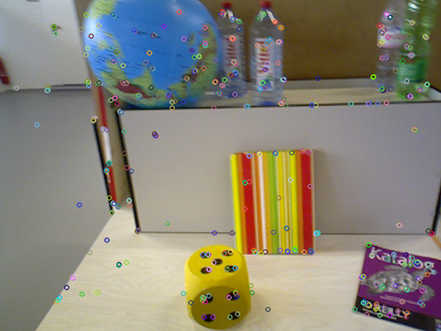
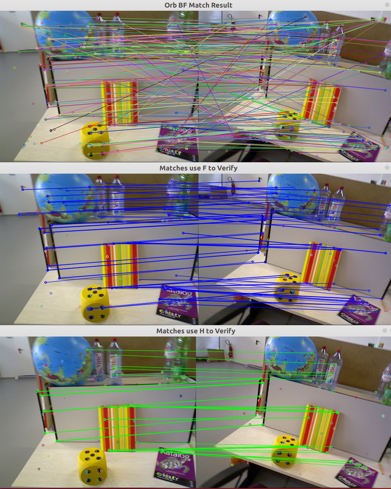

[toc]

# ORB特征的提取和匹配

## 1. 提取ORB特征

详细的提取流程可以见代码ORBExtractor中的实现，基本流程如下:

+ 建立金字塔
+ 利用四叉树的方式提取角点
+ 计算主方向
+ 提取描述子

提取结果如下:

 

> 由于使用的版本非OpenCV原生的ORB，所以特征点的分布会比较均匀

不同策略提取ORB特征可以参考: [知乎](https://zhuanlan.zhihu.com/p/57235987)

## 2. 利用二进制描述子进行暴力匹配

利用位运算的技巧，可以快速计算描述子之间的距离

```c++
int DescriptorDistance(const cv::Mat &a, const cv::Mat &b)
{
    const int *pa = a.ptr<int32_t>();
    const int *pb = b.ptr<int32_t>();

    int dist=0;

    for(int i=0; i<8; i++, pa++, pb++)
    {
        unsigned  int v = *pa ^ *pb;
        v = v - ((v >> 1) & 0x55555555);
        v = (v & 0x33333333) + ((v >> 2) & 0x33333333);
        dist += (((v + (v >> 4)) & 0xF0F0F0F) * 0x1010101) >> 24;
    }

    return dist;
}
```

参考: [位运算](http://graphics.stanford.edu/~seander/bithacks.html#CountBitsSetParallel)

## 3. 计算F/H模型，对错误匹配进行过滤

 

